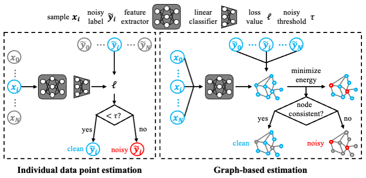
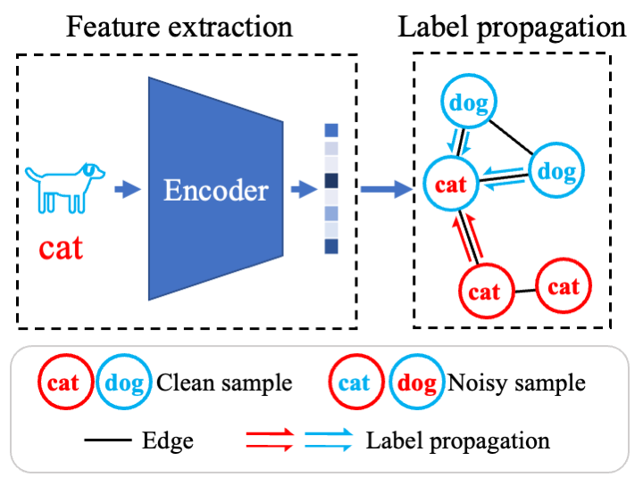

# LaplaceConfidence
This is the code for our submisssion "LaplaceConfidence: a Graph-based Approach for Learning with Noisy Labels"

Motivation

Method

# Usage

    PyTorch CIFAR Training

    optional arguments:
      -h, --help            show this help message and exit
      --batch_size BATCH_SIZE
                            train batchsize
      --warm_up WARM_UP     warm epochs
      --lr LR, --learning_rate LR
                            learning rate
      --num_epochs NUM_EPOCHS
                            number of trainig epochs
      --gpuid GPUID
      --seed SEED
      --save_name SAVE_NAME
      --data_path DATA_PATH
                            path to dataset
      --dataset DATASET
      --resume RESUME
      --T T                 temperature for sharping pseudo-labels
      --knn KNN             knn number for constructing graph
      --pca PCA             PCA dimension
      --r R                 noise ratio
      --noise_mode NOISE_MODE choose symmetrical or asymmetrical noise

## To obtain the results on CIFAR-10 or CIFAR-100

You first need to download the public dataset CIFAR in [here](https://www.cs.toronto.edu/~kriz/cifar.html), then run (the label noise will be generated automaticlly):

    python3 GLR_ce.py --data_path ** --dataset ** --num_class ** --r ** --knn **

## To obtain the results on WebVision 

You first need to download the public dataset WebVision in [here](https://data.vision.ee.ethz.ch/cvl/webvision/dataset2017.html)
Facing a real-world noisy dataset, we don't need to preprocess the label information.
Just run

    python3 LC_cifar.py --data_path ** --save_name LC_loss 

## Requirement

    python==3.6.8
    scikit-learn==0.23.2
    torch==1.7.0+cu101
    scipy==1.6.2
    Pillow==8.2.0
    pandas==1.2.4
    numpy==1.22.4
